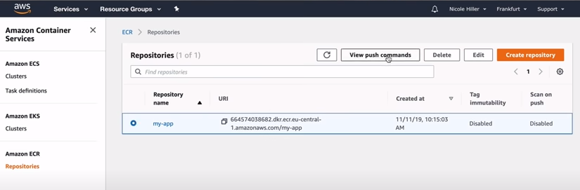
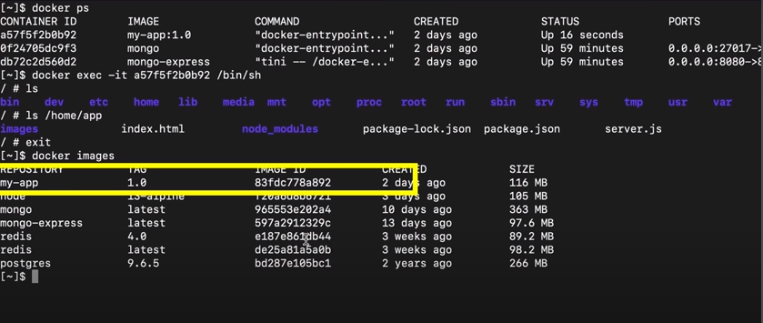

# docker-tutorial
This is a basic overview of how to use Docker.   
   

## Table of Contents

1. [Main Docker Commands](#main-docker-commands)
2. [Developing with Containers](#developing-with-containers)
3. [Docker Compose](#docker-compose)
4. [Dockerfile](#dockerfile)
5. [Docker Private Repository](#docker-private-repository)

## Main Docker Commands
#### # pull latest version from docker-hub to local environment
    docker pull  radis
#### # pull with specific version
    docker pull radis:4.0
###### *** Note: The full command is: docker pull docker.io/library/redis:4.0.[registryDomain/imageName:tag]. When we connect with docker-hub, we don't need to use docker.io/library/ portion. ***
#### # lists existing images
    docker images
    
    Output
          REPOSITORY   TAG       IMAGE ID       CREATED         SIZE
          redis        latest    5f2e708d56aa   5 days ago      117MB
          redis        4.0       191c4017dcdd   2 years ago     89.3MB
          my-test-app  1.0 	   2e0a4d16e074	  10 minutes ago    116MB
#### # remove image
    docker rmi 2e0a4d16e074
#### # At first docker run command will check locally & if not found then it will pull the image from docker-hub and create container.
    docker run redis:4.0
#### # container create  with detach mode, define port and container name
    docker run -d -p 7001:6379 --name redis-older redis:4.0
#### # lists container
    docker ps
    
    Output
          CONTAINER ID   IMAGE       COMMAND                  CREATED          STATUS         PORTS      NAMES
          8154f8444eb8   redis:4.0   "docker-entrypoint.s…"   10 minutes ago   Up 2 minutes   6379/tcp   strange_benz
          2595ae900411   redis       "docker-entrypoint.s…"   14 minutes ago   Up 2 minutes   6379/tcp   silly_ellis
#### # lists container only id
    docker ps -aq
    Output
        2e0a4d16e074
        8154f8444eb8
        2595ae900411
#### # remove docker container
    docker rm 2e0a4d16e074
#### # lists both running & stoped container
    docker ps -a
    
    Output
        	 CONTAINER ID   IMAGE       COMMAND                  CREATED          STATUS                     PORTS      NAMES
          8154f8444eb8   redis:4.0   "docker-entrypoint.s…"   8 minutes ago    Exited (0) 2 minutes ago              strange_benz
          2595ae900411   redis       "docker-entrypoint.s…"   11 minutes ago   Up 19 seconds              6379/tcp   silly_ellis
#### # container start by id or name
    docker start 8154f8444eb8/redis-older
#### # container stop by id or name
    docker stop 8154f8444eb8/redis-older
#### # container logs by id or name
    docker logs 8154f8444eb8/redis-older
#### # interactive terminal. On interactive terminal,type env to show the env details
    docker exec -it redis-older /bin/bash or /bin/sh
    or
    docker exec -it redis-older /bin/bash or /bin/bash
#### # docker network
    docker newtork
#### # create network
    docker network create redis-network
#### # container start using docker-composer.yml file which create default network name
    docker-compose -f docker_compose.yml up
#### # container stop and remove the default network
    docker-compose -f docker_compose.yml down
#### # build image using Dockerfile
    docker build -t my-app:1.0 .
##### *** Note: first param: my-app is the image name and also set desire version. second param: Dockerfile location. ***

### Developing with Containers
#### # run mongo under a network
      docker run -d \
         --name mongodb \
         -p 27017:27017 \
          --network mongo-network \
         -e MONGO_INITDB_ROOT_USERNAME="admin" \
         -e MONGO_INITDB_ROOT_PASSWORD="12345" \
       mongo
#### # run mongo express under a network
      docker run -d \
         --name mongo-express \
         -p 8081:8081 \
         --network mongo-express \
         -e ME_CONFIG_MONGODB_SERVER="mongodb" \
         -e ME_CONFIG_BASICAUTH_USERNAME="admin" \
         -e ME_CONFIG_BASICAUTH_PASSWORD="12345" \
       mongo-express
#### # check container list
      docker ps
      
      Output
            CONTAINER ID   IMAGE       	    COMMAND                  CREATED          STATUS         PORTS              NAMES
            8154f8444eb8   mongo-express    "tini -- /docker-enc"    10 minutes ago   Up 2 minutes   0.0.0.0:8081/tcp   mongo-express
            2595ae900411   mongo            "docker-entrypoint.s…"   14 minutes ago   Up 2 minutes   0.0.0.0:27017/tcp  mongodb

### Docker Compose
Docker compose is a structural way to cantain very normal/common docker container conmmands that we can pull docker images.
First create a docker_compose.yml file at rood directory and follow the instruction.

      version: "3"
      services:
         mongodb:
            image: mongo
            ports:
               - 270170:270170
            environment:
               - MONGO_INITDB_ROOT_USERNAME="admin"
               - MONGO_INITDB_ROOT_PASSWORD="12345"

         mongo-express:
            image: mongo-express
            ports: 
               - 8081:8081
            environment:
               - ME_CONFIG_MONGODB_SERVER="mongodb"
               - ME_CONFIG_BASICAUTH_USERNAME="admin"
               - ME_CONFIG_BASICAUTH_PASSWORD="12345"
Details
 
      ├── version: "3"         # version of docker compose
      ├── services             # container lists
      ├── mongodb              # container name
      ├── image                # docker image, here also add tag
      └── ports                # host_port_no:container_port_no
Now Run the compose command to container and network

      docker-compose -f docker_compose.yml up
      
      Output
         Creating networks "myapp_default" with the default driver
         Creating myapp_mongodb_1
         Creating myapp_mongo_express_1
         Attaching to myapp_mongodb_1, myapp_mongo_express_1
         ... ... ...
and check the network

      docker network ls
      
      Output
         NETWORK ID     NAME            DRIVER    SCOPE
         b852e4140c71   bridge          bridge    local
         77836933d637   host            host      local
         76336ed7319d   none            null      local
         c8e4130da08e   redis-network   bridge    local
         dcb520p720ef   myadd_default   bridge    local
also container

      docker ps
      
      Output
         CONTAINER ID   IMAGE       	  COMMAND                  CREATED          STATUS         PORTS              NAMES
         8154f8444eb8   mongo-express    "tini -- /docker-enc"    10 minutes ago   Up 2 minutes   0.0.0.0:8081/tcp   myapp_mongo-express_1
         2595ae900411   mongo            "docker-entrypoint.s…"   14 minutes ago   Up 2 minutes   0.0.0.0:27017/tcp  myapp_mongodb_1
at last shut down the container and network

      docker-compose -f docker_compose.yml up
      
      Output
         Stopping myapp_mongodb_1 ... done
         Stopping myapp_mongo_express_1 ... done
         Removing myapp_mongo_express_1 ... done
         Removing myapp_mongodb_1 ... done
         Removing networks "myapp_default"

### Dockerfile
Dockerfile is a blueprint of docker image. Create a Dockerfile at the root of project.

      FROM node:13-alpine
      ENV MONGO_DB_USERNAME='admin'\
         MONGO_DB_PWD='12345'
      RUN mkdir -p /home/app
      COPY . /home/app
      CMD ["node", "/home/app/server.js"]
Details
 
      ├── node:13-alpine         # install node
      ├── RUN                    # linux command which execute inside docker container not host machine
      ├── COPY                   # xecute host machine instead of 
      └── CMD                    # entry point command, start the app with "node server.js"
Execute the following commands

      docker build -t my-app:1.0
      
      Output
         app listing on port 3000
      
Check docker image

      docker images
      
      Output
         	REPOSITORY      TAG       IMAGE ID       CREATED       	  SIZE
            my-app  	 	    1.0 	     2e0a4d16e074	  10 minutes ago   116MB
            mongo        	 latest    5f2e708d56aa   5 days ago       117MB
            mongo-express   4.0       191c4017dcdd   2 years ago      89.3MB
            redis           latest    5f2e708d56aa   5 days ago       117MB
            redis           4.0       191c4017dcdd   2 years ago      89.3MB
Multi-image layer   

### Docker Private Repository
First login AWS, create a reposity "my-app" under ERC(elastic registry container) service and follow the sequence steps:   
*** Note: Jenkins is responsible to do this process. But here we will simulate it manually. ***   
   
   
   
   
   
   
   
   
   
   
   
   
   
   
   

      
      

         
    
